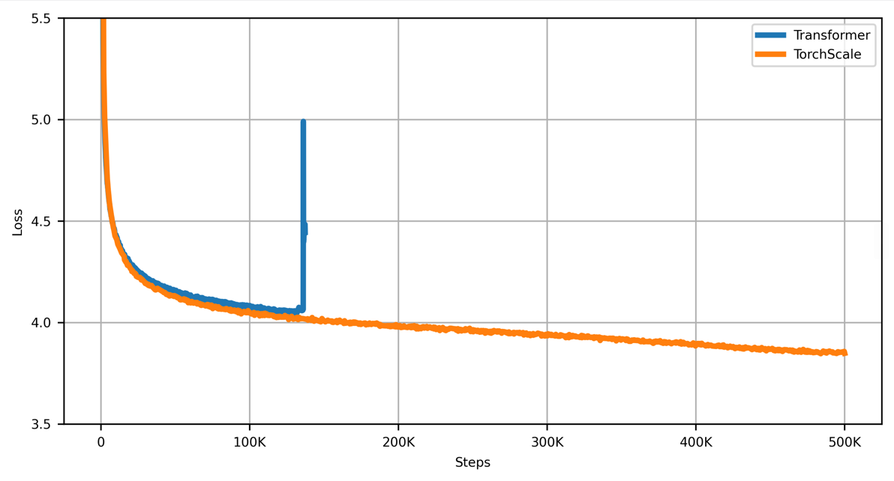
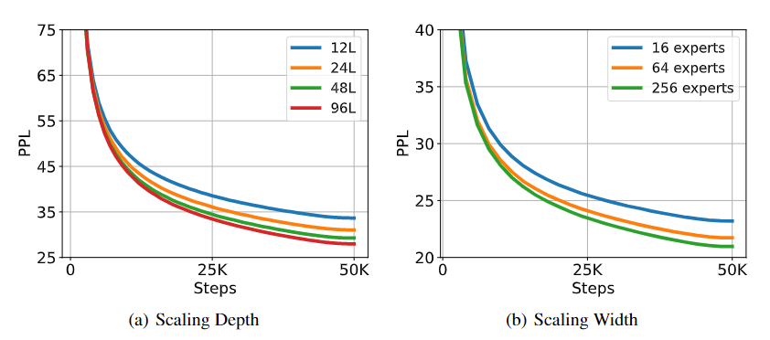

# TorchScale - A Library for Transformers at (Any) Scale

<p>
  <a href="https://github.com/microsoft/torchscale/blob/main/LICENSE"></a>
  <a href="https://pypi.org/project/torchscale"></a>
</p>

TorchScale is a PyTorch library that allows researchers and developeres to scale up Transformers efficiently and effectively.
It has the implemetention of fundamental research to improve modeling generality and capability, as well as training stability and efficiency of scaling Transformers.

- Stability - [**DeepNet**](https://arxiv.org/abs/2203.00555): scaling Transformers to 1,000 Layers and beyond
- Generality - [**Foundation Transformers (Magneto)**](https://arxiv.org/abs/2210.06423)
- Efficiency - [**X-MoE**](https://arxiv.org/abs/2204.09179): scalable & finetunable sparse Mixture-of-Experts (MoE)

## News

- November, 2022: TorchScale 0.1.1 released

## Installation

To install:
```
pip install torchscale
```

Alternatively, you can develop it locally:
```
git clone https://github.com/microsoft/torchscale.git
cd torchscale
pip install -e .
```

## Getting Started

It takes only several lines of code to create a model with the above fundamental research features enabled. Here is how to quickly obtain a BERT-like encoder:

```python
>>> from torchscale.architecture.config import EncoderConfig
>>> from torchscale.architecture.encoder import Encoder

>>> config = EncoderConfig(vocab_size=64000)
>>> model = Encoder(config)

>>> print(model)
```

We also support the `Decoder` architecture and the `EncoderDecoder` architecture:

```python
# Creating a decoder model
>>> from torchscale.architecture.config import DecoderConfig
>>> from torchscale.architecture.decoder import Decoder

>>> config = DecoderConfig(vocab_size=64000)
>>> decoder = Decoder(config)
>>> print(decoder)

# Creating a encoder-decoder model
>>> from torchscale.architecture.config import EncoderDecoderConfig
>>> from torchscale.architecture.encoder_decoder import EncoderDecoder

>>> config = EncoderDecoderConfig(vocab_size=64000)
>>> encdec = EncoderDecoder(config)
>>> print(encdec)
```

## Examples

We have the examples of how to use TorchScale in the following scenarios/tasks:

- Language

  * [Decoder/GPT](examples/fairseq/README.md#example-gpt-pretraining)

  * [Encoder-Decoder/Neural Machine Translation](examples/fairseq/README.md#example-machine-translation)

  * [Encoder/BERT](examples/fairseq/README.md#example-bert-pretraining)

- Vision

  * ViT/BEiT [In progress]

- Speech

- Multimodal

  * [Multiway Transformers/BEiT-3](torchscale/model/BEiT3.py) [In progress]

We plan to provide more examples regarding different tasks (e.g. vision pretraining and speech recognition) and various deep learning toolkits (e.g. [DeepSpeed](https://github.com/microsoft/DeepSpeed) and [Megatron-LM](https://github.com/NVIDIA/Megatron-LM)). Any comments or PRs are welcome!

## Results

### Stability Evaluation

<p align="center">
  
</p>

The training curve is smooth by using TorchScale, while the baseline Transformer cannot converge.

### Scaling-up Experiments

<p align="center">
  
</p>

TorchScale supports arbitrary depths and widths, successfully scaling-up the models without pain.

## Acknowledgments

Some implementations in TorchScale are either adapted from or inspired by the [FairSeq](https://github.com/facebookresearch/fairseq) repository and the [UniLM](https://github.com/microsoft/unilm) repository.

## Citations

If you find this repository useful, please consider citing our work:

```
@article{deepnet,
  author    = {Hongyu Wang and
               Shuming Ma and
               Li Dong and
               Shaohan Huang and
               Dongdong Zhang and
               Furu Wei},
  title     = {{DeepNet}: Scaling Transformers to 1,000 Layers},
  journal   = {CoRR},
  volume    = {abs/2203.00555},
  year      = {2022},
}
```

```
@article{magneto,
  author    = {Hongyu Wang and
               Shuming Ma and
               Shaohan Huang and
               Li Dong and
               Wenhui Wang and
               Zhiliang Peng and
               Yu Wu and
               Payal Bajaj and
               Saksham Singhal and
               Alon Benhaim and
               Barun Patra and
               Zhun Liu and
               Vishrav Chaudhary and
               Xia Song and
               Furu Wei},
  title     = {Foundation Transformers},
  journal   = {CoRR},
  volume    = {abs/2210.06423},
  year      = {2022}
}
```

```
@article{xmoe,
  author    = {Zewen Chi and
               Li Dong and
               Shaohan Huang and
               Damai Dai and
               Shuming Ma and
               Barun Patra and
               Saksham Singhal and
               Payal Bajaj and
               Xia Song and
               Furu Wei},
  title     = {On the Representation Collapse of Sparse Mixture of Experts},
  journal   = {CoRR},
  volume    = {abs/2204.09179},
  year      = {2022}
}
```

## Contributing

This project welcomes contributions and suggestions.  Most contributions require you to agree to a
Contributor License Agreement (CLA) declaring that you have the right to, and actually do, grant us
the rights to use your contribution. For details, visit https://cla.opensource.microsoft.com.

When you submit a pull request, a CLA bot will automatically determine whether you need to provide
a CLA and decorate the PR appropriately (e.g., status check, comment). Simply follow the instructions
provided by the bot. You will only need to do this once across all repos using our CLA.

This project has adopted the [Microsoft Open Source Code of Conduct](https://opensource.microsoft.com/codeofconduct/).
For more information see the [Code of Conduct FAQ](https://opensource.microsoft.com/codeofconduct/faq/) or
contact [Furu Wei](mailto:fuwei@microsoft.com) and [Shuming Ma](mailto:shumma@microsoft.com) with any additional questions or comments.

## Trademarks

This project may contain trademarks or logos for projects, products, or services. Authorized use of Microsoft 
trademarks or logos is subject to and must follow 
[Microsoft's Trademark & Brand Guidelines](https://www.microsoft.com/en-us/legal/intellectualproperty/trademarks/usage/general).
Use of Microsoft trademarks or logos in modified versions of this project must not cause confusion or imply Microsoft sponsorship.
Any use of third-party trademarks or logos are subject to those third-party's policies.